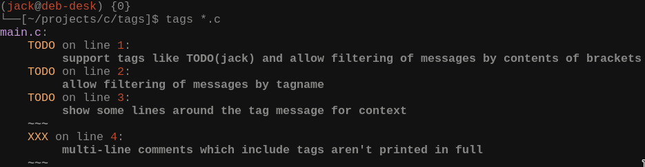

# Tags

## Installing:
`make && sudo make install`
## Basic usage:
`tags <source code file(s)>`

Tags searches source code files for comments which include codetags,
these are character sequences like `@TODO` and `@FIXME`. When a codetag
is found the comment it is included in is written to stdout along with the
number of the line it was found on.

## Example usage

## Uninstalling
`sudo make uninstall`
